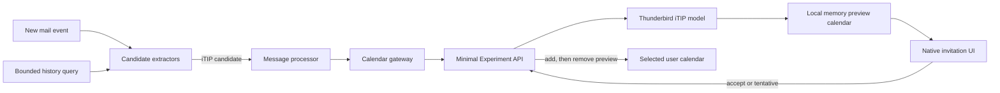

# Architecture

## Stable MailExtension layer

`src/extractors/ics-extractor.js` uses only the public `messages` API. An
extractor returns candidates and has no calendar access. The application service
in `src/application/process-message.js` accepts an array of extractors, filters
candidate types, deduplicates revisions, and forwards supported candidates to a
calendar gateway. `src/application/history-scan.js` creates the bounded query
for existing mail and excludes outgoing, junk, draft, template, and trash
folders. Read state is deliberately not filtered.

## Privileged calendar layer

`api/invitationPreview/implementation.js` is the only privileged module. It:

1. parses the original invitation with Thunderbird's calendar parser;
2. selects a writable target calendar whose configured email matches an invited
  identity, falling back to Thunderbird's default calendar;
3. creates a dedicated local memory calendar for pending previews;
4. performs UID- and revision-aware add, update, and cancel operations directly
  on that isolated memory provider;
5. stores a `NEEDS-ACTION` event with its original UID and intended target;
6. sets `TRANSP:TRANSPARENT` while the event is pending;
7. after an acceptance or tentative acceptance, restores the original
  transparency and adds the event to the selected target calendar;
8. removes the local copy only after that target add succeeds, while a decline
  removes the local copy without creating a target event;
9. retains failed transfers with their response status and exact target so they
  can be retried after reconciliation or restart without another RSVP.

Thunderbird 154's remote cached calendar model can indefinitely block item
access while building its global recurrence cache. The dedicated memory calendar
avoids all Storage/CalDAV cache access while scanning. Pending ICS payloads are
kept in local extension storage and restored into the memory calendar after an
application restart. No Thunderbird prototype or calendar database is modified
directly. The manifest remains limited to `154.*` because this Experiment uses
Thunderbird's internal calendar interfaces.

The generic Thunderbird iTIP item finder is intentionally not used for preview
storage because it can inherit a blocked calendar lookup. The stored event still
uses Thunderbird's native invitation model and response transport through its
`X-MOZ-INVITED-ATTENDEE` metadata.

Using the original UID is intentional. Thunderbird can then update the same
event for a later request, avoid duplicates, and process the user's response in
place. Existing accepted events are never replaced automatically. Cancellation
messages only remove events previously marked by this add-on.

## Security boundaries

- Junk messages are ignored.
- Inputs are limited to 1 MiB and 50 `VEVENT` components.
- Only `METHOD:REQUEST` with organizer and attendee data is staged.
- Only `METHOD:CANCEL` can remove a staged item.
- The Experiment does not expose arbitrary file, network, preference, or DOM
  access to the MailExtension layer.
- There is no remote code, telemetry, HTML rendering, or dynamic code execution.